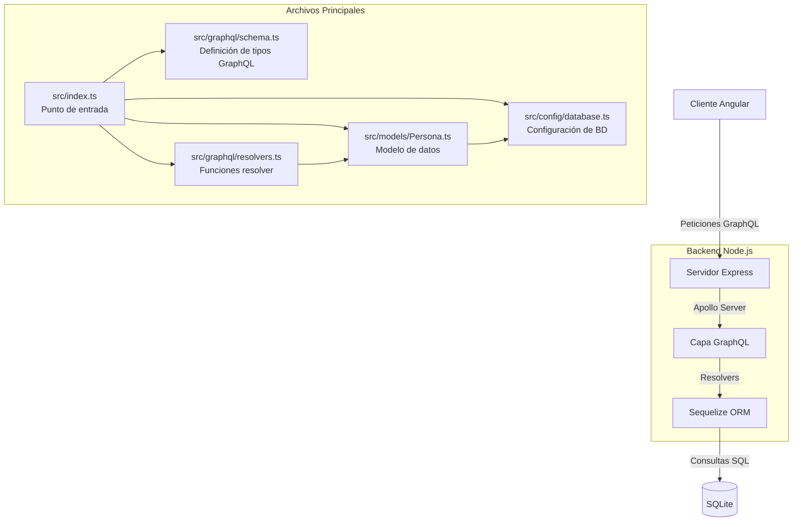
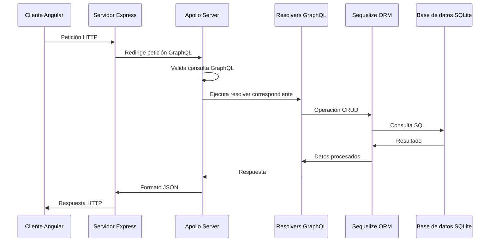
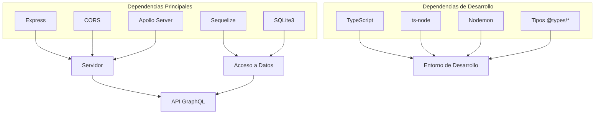

# Arquitectura del Proyecto

## Diagrama de Arquitectura del Backend

```mermaid
graph TD
    Client[Cliente Angular] -->|Peticiones GraphQL| Server[Servidor Express]
    Server -->|Apollo Server| GraphQL[Capa GraphQL]
    GraphQL -->|Resolvers| ORM[Sequelize ORM]
    ORM -->|Consultas SQL| DB[(SQLite)]
    
    subgraph "Backend Node.js"
        Server
        GraphQL
        ORM
    end
    
    subgraph "Archivos Principales"
        index.ts[src/index.ts<br>Punto de entrada]
        schema[src/graphql/schema.ts<br>Definición de tipos GraphQL]
        resolvers[src/graphql/resolvers.ts<br>Funciones resolver]
        model[src/models/Persona.ts<br>Modelo de datos]
        db[src/config/database.ts<br>Configuración de BD]
    end
    
    index.ts --> schema
    index.ts --> resolvers
    index.ts --> model
    index.ts --> db
    resolvers --> model
    model --> db
```

## Flujo de Datos en el Backend

```mermaid
sequenceDiagram
    participant Cliente as Cliente Angular
    participant Express as Servidor Express
    participant Apollo as Apollo Server
    participant Resolvers as Resolvers GraphQL
    participant Sequelize as Sequelize ORM
    participant SQLite as Base de datos SQLite
    
    Cliente->>Express: Petición HTTP
    Express->>Apollo: Redirige petición GraphQL
    Apollo->>Apollo: Valida consulta GraphQL
    Apollo->>Resolvers: Ejecuta resolver correspondiente
    Resolvers->>Sequelize: Operación CRUD
    Sequelize->>SQLite: Consulta SQL
    SQLite->>Sequelize: Resultado
    Sequelize->>Resolvers: Datos procesados
    Resolvers->>Apollo: Respuesta
    Apollo->>Express: Formato JSON
    Express->>Cliente: Respuesta HTTP
```

## Estructura de Dependencias

```mermaid
graph TD
    Express[Express] --> Server[Servidor]
    CORS[CORS] --> Server
    Apollo[Apollo Server] --> Server
    TypeORM[Sequelize] --> DB[Acceso a Datos]
    SQLite[SQLite3] --> DB
    
    Server --> API[API GraphQL]
    DB --> API
    
    subgraph "Dependencias Principales"
        Express
        CORS
        Apollo
        TypeORM
        SQLite
    end
    
    subgraph "Dependencias de Desarrollo"
        TS[TypeScript]
        TSNode[ts-node]
        Nodemon[Nodemon]
        Types[Tipos @types/*]
    end
    
    TS --> DevEnv[Entorno de Desarrollo]
    TSNode --> DevEnv
    Nodemon --> DevEnv
    Types --> DevEnv
```