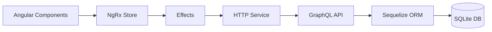

Sistema de Gestión de Personas - Examen Técnico GPX
===================================================

📖 Descripción del Proyecto
---------------------------

Aplicación web full-stack para gestionar personas con operaciones CRUD completas desarrollada con Angular 19 y Node.js + GraphQL. El proyecto implementa una arquitectura modular y sigue las mejores prácticas de desarrollo.

### Requisitos Cumplidos ✅

*   **Frontend**: Angular 19 con componentes standalone
*   **Backend**: Node.js con Express y GraphQL
*   **Base de Datos**: SQLite con Sequelize ORM
*   **Estado**: NgRx para manejo reactivo
*   **Estándares**: ES6+, TypeScript, RxJS
*   **Seguridad**: Variables de entorno y configuración por ambiente
*   **Calidad**: ESLint y TypeScript strict mode

🏗️ Arquitectura del Sistema
----------------------------



🛠️ Tecnologías y Versiones
---------------------------

### Entorno de Desarrollo

*   **Node.js**: 20.18.3
*   **npm**: 11.4.0
*   **Angular CLI**: 19.2.12

### Backend Dependencies

```json
{
  "dependencies": {
    "@graphql-tools/schema": "8.3.13",
    "apollo-server-express": "3.11.1",
    "cors": "2.8.5",
    "dotenv": "16.0.3",
    "express": "4.18.2",
    "graphql": "16.6.0",
    "sequelize": "6.31.1",
    "sqlite3": "5.1.6"
  }
}
```

### Frontend Dependencies

```json
{
  "dependencies": {
    "@angular/common": "^19.2.0",
    "@angular/compiler": "^19.2.0",
    "@angular/core": "^19.2.0",
    "@angular/forms": "^19.2.0",
    "@angular/platform-browser": "^19.2.0",
    "@angular/platform-browser-dynamic": "^19.2.0",
    "@angular/router": "^19.2.0",
    "@ngrx/effects": "^19.2.1",
    "@ngrx/entity": "^19.2.1",
    "@ngrx/store": "^19.2.1",
    "@ngrx/store-devtools": "^19.2.1",
    "rxjs": "~7.8.0",
    "tslib": "^2.3.0",
    "zone.js": "~0.15.0"
  }
}
```

📁 Estructura del Proyecto
--------------------------

```json
technical-exam/
├── backend/
│   ├── src/
│   │   ├── config/
│   │   │   ├── database.ts
│   │   │   └── environment.ts
│   │   ├── graphql/
│   │   │   ├── definitions/
│   │   │   ├── inputs/
│   │   │   ├── mutations/
│   │   │   ├── queries/
│   │   │   ├── resolvers/
│   │   │   └── schema.ts
│   │   ├── models/
│   │   │   └── Persona.ts
│   │   └── index.ts
│   ├── .env
│   ├── package.json
│   └── tsconfig.json
├── frontend-angular/
│   ├── src/app/
│   │   ├── components/
│   │   ├── models/
│   │   ├── services/
│   │   ├── store/
│   │   └── app.config.ts
│   └── package.json
└── README.md
```

🚀 Instalación y Configuración
------------------------------

### Backend

1. Configurar variables de entorno:
```bash
# Crear archivo .env en la raíz del backend
PORT=3000
NODE_ENV=development
DB_PATH=./database.sqlite
GRAPHQL_PATH=/graphql
```

2. Instalar dependencias y ejecutar:
```bash
cd backend
npm install
npm run dev
# http://localhost:3000/graphql
```

### Frontend

```bash
cd frontend-angular
npm install
ng serve
# http://localhost:4200
```

⚡ Funcionalidades Implementadas
-------------------------------

### GraphQL Operations

#### Crear Persona
```graphql
mutation CrearPersona($input: PersonaInput!) {
  crearPersona(input: $input) {
    id
    nombres
    apellidoPaterno
    apellidoMaterno
    direccion
    telefono
  }
}
```

#### Listar Personas
```graphql
query ObtenerPersonas {
  personas {
    id
    nombres
    apellidoPaterno
    apellidoMaterno
    direccion
    telefono
  }
}
```

#### Actualizar Persona
```graphql
mutation ActualizarPersona($id: ID!, $input: PersonaInput!) {
  actualizarPersona(id: $id, input: $input) {
    id
    nombres
    apellidoPaterno
    apellidoMaterno
    direccion
    telefono
  }
}
```

#### Eliminar Persona
```graphql
mutation EliminarPersona($id: ID!) {
  eliminarPersona(id: $id)
}
```

🔒 Seguridad y Configuración
----------------------------

### Variables de Entorno
El backend utiliza variables de entorno para configurar:
- Puerto del servidor
- Ambiente (desarrollo/producción)
- Ruta de la base de datos
- Ruta del endpoint GraphQL

### Configuración por Ambiente
- **Desarrollo**: 
  - Introspection habilitada
  - Logs detallados
  - Sincronización automática de la base de datos
- **Producción**:
  - Introspection deshabilitada
  - Logs mínimos
  - Mensajes de error genéricos

🎯 Mejores Prácticas Implementadas
---------------------------------

1. **Arquitectura Modular**
   - Separación clara de responsabilidades
   - Estructura GraphQL modular
   - Resolvers organizados por funcionalidad

2. **Tipado Fuerte**
   - TypeScript strict mode
   - Interfaces y tipos definidos
   - Validación de tipos en tiempo de compilación

3. **Manejo de Errores**
   - Errores tipados
   - Mensajes de error personalizados
   - Logging estructurado

4. **Seguridad**
   - Variables de entorno
   - Configuración por ambiente
   - Validación de entrada

5. **Calidad de Código**
   - ESLint para linting
   - TypeScript para type checking
   - Estructura de proyecto clara y organizada

✅ Características Destacadas
----------------------------

*   **CRUD Completo**: Crear, leer, actualizar, eliminar personas
    
*   **Búsqueda en Tiempo Real**: Filtrado reactivo por nombre/apellidos
    
*   **Validaciones**: Frontend (Angular Forms) y Backend (Sequelize)
    
*   **Estado Reactivo**: NgRx Store con Effects y Selectors
    
*   **Tipado Fuerte**: TypeScript en frontend y backend
    
*   **Componentes Modernos**: Standalone components de Angular 19
    
*   **GraphQL Schema**: API tipada y autodocumentada
    
*   **Base de Datos**: SQLite con ORM Sequelize
    

**Desarrollado para**: Examen Técnico Global Primex Tecnología
**Tecnologías**: Angular 19, Node.js, GraphQL, SQLite, NgRx, TypeScript