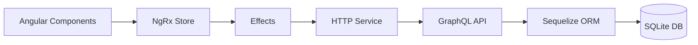
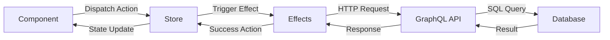
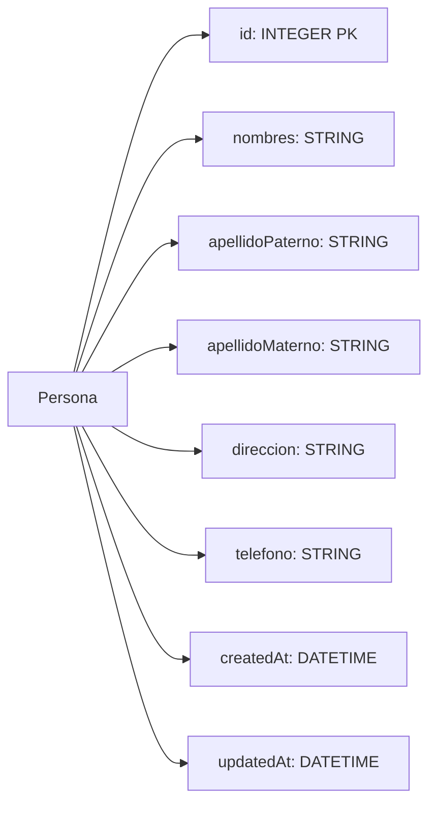

Sistema de Gestión de Personas - Examen Técnico GPX
===================================================

📖 Descripción del Proyecto
---------------------------

Aplicación web full-stack para gestionar personas con operaciones CRUD completas desarrollada con Angular 19 y Node.js + GraphQL.

### Requisitos Cumplidos ✅

*   **Frontend**: Angular 19 con componentes standalone
    
*   **Backend**: Node.js con Express y GraphQL
    
*   **Base de Datos**: SQLite con Sequelize ORM
    
*   **Estado**: NgRx para manejo reactivo
    
*   **Estándares**: ES6+, TypeScript, RxJS
    

🏗️ Arquitectura del Sistema
----------------------------




🛠️ Tecnologías y Versiones
---------------------------

### Entorno de Desarrollo

*   **Node.js**: 20.18.3
    
*   **npm**: 11.4.0
    
*   **Angular CLI**: 19.2.12
    

### Frontend Dependencies

```json
{
  "dependencies": {
    "@angular/common": "^19.2.0",
    "@angular/compiler": "^19.2.0",
    "@angular/core": "^19.2.0",
    "@angular/forms": "^19.2.0",
    "@angular/platform-browser": "^19.2.0",
    "@angular/platform-browser-dynamic": "^19.2.0",
    "@angular/router": "^19.2.0",
    "@ngrx/effects": "^19.2.1",
    "@ngrx/entity": "^19.2.1",
    "@ngrx/store": "^19.2.1",
    "@ngrx/store-devtools": "^19.2.1",
    "rxjs": "~7.8.0",
    "tslib": "^2.3.0",
    "zone.js": "~0.15.0"
  },
  "devDependencies": {
    "@angular-devkit/build-angular": "^19.2.12",
    "@angular/cli": "^19.2.12",
    "@angular/compiler-cli": "^19.2.0",
    "@types/jasmine": "~5.1.0",
    "typescript": "~5.7.2"
  }
}
```

📁 Estructura del Proyecto
--------------------------

```json
`technical-exam/ 
├── backend/ 
│ ├── src/ 
│ │ ├── config/database.js 
│ │ ├── models/Persona.js 
│ │ ├── schema/ 
│ │ │ ├── typeDefs.js 
│ │ │ └── resolvers.js 
│ │ └── index.ts 
│ ├── package.json 
│ └── tsconfig.json 
├── frontend/ 
│ ├── src/app/ 
│ │ ├── components/ 
│ │ ├── models/persona.model.ts 
│ │ ├── services/persona.service.ts 
│ │ ├── store/persona/ 
│ │ ├── app.component.ts 
│ │ └── app.config.ts 
│ └── package.json 
└── README.md`
```

🚀 Instalación y Configuración
------------------------------

### Backend

```json
npm install    
npm run build    
npm run dev    
# http://localhost:3000
```


### Frontend

```json
frontend    
npm install    
ng serve       
# http://localhost:4200
```


⚡ Funcionalidades Implementadas
-------------------------------

### GraphQL Operations

#### Crear Persona

```json
CrearPersona($input: PersonaInput!) 
{      
    crearPersona(input: $input) 
    {        
        id 
        nombres 
        apellidoPaterno 
        apellidoMaterno 
        direccion 
        telefono     
    }    
}
```

#### Listar Personas

```json
ObtenerPersonas 
{      
    personas 
    {        
        id 
        nombres 
        apellidoPaterno 
        apellidoMaterno 
        direccion 
        telefono      
    }    
}
```

#### Actualizar Persona

```json
ActualizarPersona($id: ID!, $input: PersonaInput!) 
{      
    actualizarPersona(id: $id, input: $input) 
    {        
        id nombres 
        apellidoPaterno 
        apellidoMaterno 
        direccion 
        telefono      
    }    
}
```

#### Eliminar Persona

```json
EliminarPersona($id: ID!) 
{      
    eliminarPersona(id: $id)    
}
```

📊 Diagramas Técnicos
---------------------

### Flujo de Datos NgRx



### Base de Datos



🎯 Patrones Implementados
-------------------------

### 1\. Componentes Standalone (Angular 19)

```json
Code@Component({      
    selector: 'app-persona-list',      
    standalone: true,      
    imports: [CommonModule, FormsModule],      
    templateUrl: './persona-list.component.html'    
})
```

### 2\. NgRx con inject()

```json
class PersonaEffects 
{      
    private actions$ = inject(Actions);      
    private personaService = inject(PersonaService);      
    loadPersonas$ = createEffect(() => 
    {        
        return this.actions$.pipe(ofType(PersonaActions.loadPersonas),          
        switchMap(() => this.personaService.getPersonas())        
        );      
    });    
}
```

### 3\. Reactive Programming

```json
Búsqueda reactiva    
filteredPersonas$ = combineLatest([this.store.select(selectAllPersonas), this.searchTerm$]).pipe(map(([personas, term]) => this.filterPersonas(personas, term));
```  

🧠 Decisiones Técnicas Clave
----------------------------

### ¿Por qué Angular 19 Standalone?

*   Mejor tree-shaking y performance
    
*   Eliminación de NgModules
    
*   Sintaxis moderna y menos boilerplate
    

### ¿Por qué GraphQL?

*   Single endpoint /graphql
    
*   Tipado fuerte con schema
    
*   Prevención de over-fetching
    
*   Herramientas de desarrollo integradas
    

### ¿Por qué NgRx?

*   Estado predecible y debuggeable
    
*   Manejo de side-effects con Effects
    
*   Time-travel debugging
    
*   Patrón Redux probado
    

### ¿Por qué SQLite + Sequelize?

*   Base de datos embebida sin configuración
    
*   ORM con validaciones y migraciones
    
*   Perfecto para desarrollo y demos
    

🔧 Comandos Útiles
------------------

### Backend

```json
# Desarrollo con hot reload    
npm run build   
# Compilar TypeScript    
npm start       
# Producción
```  

### Frontend

```json
# Desarrollo    
ng build --prod            
# Build producción    
ng test                    
# Tests unitarios
```

### GraphQL Code Code Playground

*   Acceder a: [http://localhost:3000/graphql](http://localhost:3000/graphql)
    
*   Explorar schema y ejecutar queries
    

✅ Características Destacadas
----------------------------

*   **CRUD Completo**: Crear, leer, actualizar, eliminar personas
    
*   **Búsqueda en Tiempo Real**: Filtrado reactivo por nombre/apellidos
    
*   **Validaciones**: Frontend (Angular Forms) y Backend (Sequelize)
    
*   **Estado Reactivo**: NgRx Store con Effects y Selectors
    
*   **Tipado Fuerte**: TypeScript en frontend y backend
    
*   **Componentes Modernos**: Standalone components de Angular 19
    
*   **GraphQL Schema**: API tipada y autodocumentada
    
*   **Base de Datos**: SQLite con ORM Sequelize
    

**Desarrollado para**: Examen Técnico Global Primex Tecnología
**Tecnologías**: Angular 19, Node.js, GraphQL, SQLite, NgRx, TypeScript